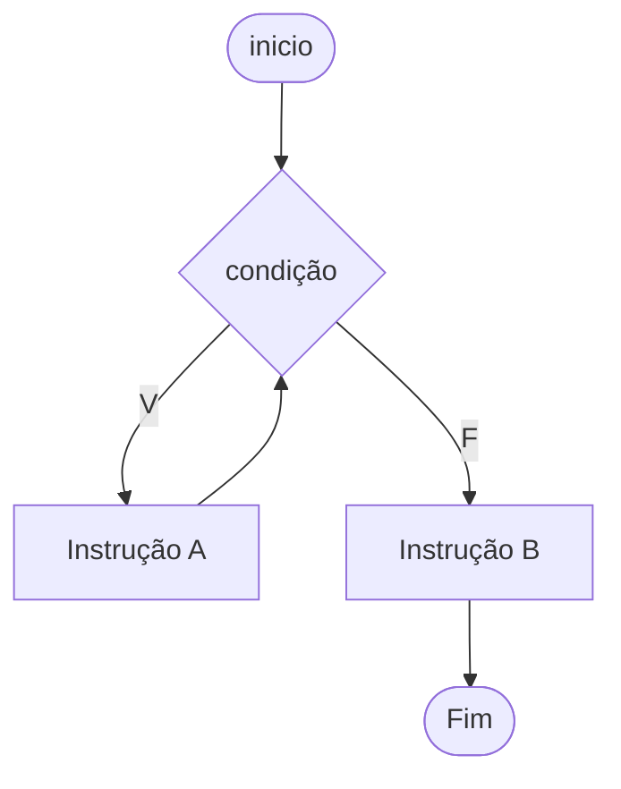
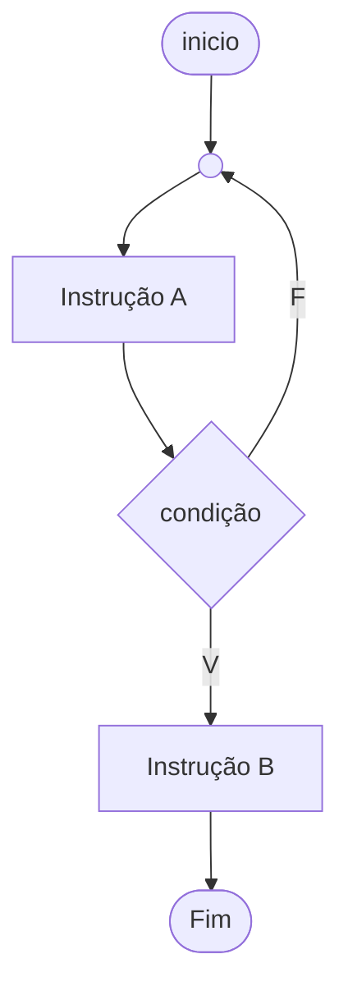
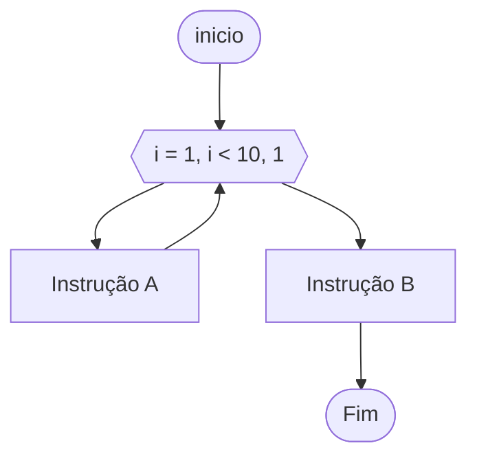

# Estruturas de repetição

As estruturas de repetição possibilitam que os algoritmos possam repetir um determinado bloco de instruções com base numa validação.

Desta forma podemos por exemplo realizar inúmeras partidas de Jokenpo, até que nós possamos escolher quando parar.

Podemos também realizar a apuração de uma eleição de um grêmio ou coletar o IMC da galera; agora podemos fazer com que nosso código possa ser executado repetidamente e controlando o fluxo de repetição.

## Estruturas de repetição condicionais

As estruturas de repetição condicionais nos possibilitam definir uma expressão de controle sobre um bloco de repetição.

### Estrutura Enquanto-Faça

A estrutura enquanto-faça é uma estrutura de iteração ou laço de repetição condicional, esta estrutura faz com que um bloco condicional seja executado repetidamente enquanto uma condição de validação tiver como resultado o valor `verdadeiro`, quando esta validação deixar de ser verdadeira, a repetição do bloco de instruçãoes é cessada.

> Nós a utilizamos quando um conjunto de instruções deva ser executado repetidamente e este número de repetições seja incerto, assim como a condição de finalização da repetição esteja associada à uma validação não quantitativa. 



#### O exemplo do Jogo de Advinhação

```
Algoritmo "guess_game_nossa_versao"
// Disciplina   : [Linguagem e Lógica de Programação]
// Professor   : Esdras Bezerra da Silva
// Descrição   : Aqui você descreve o que o programa faz! (função)
// Autor(a)    : Nome do(a) aluno(a)
// Data atual  : 05/08/2023
Var
   // Seção de Declarações das variáveis
   chute, valor_que_pensei, diferenca: inteiro
   ajuste: caractere

Inicio
   // Seção de Comandos, procedimento, funções, operadores, etc...

   aleatorio on
   aleatorio 1,100
   leia(valor_que_pensei)
   limpatela
   aleatorio off

   enquanto (chute <> valor_que_pensei) faca
      escreval("Digite um valor")
      leia(chute)
      diferenca <- abs(chute - valor_que_pensei)
      se (chute = valor_que_pensei) entao
         escreval("Acertou! O valor era ", valor_que_pensei)
      senao
         se (chute > valor_que_pensei) entao
            ajuste <- "Diminua um pouco!"
         senao
            ajuste <- "Aumente um pouco!"
         fimse
         se (diferenca < 5) entao
            escreval("Esta muito quente! ", ajuste )
         senao
            se (diferenca < 10) entao
               escreval("Esta quente! ", ajuste)
            senao
               se (diferenca < 15) entao
                  escreval("Esta frio! ", ajuste)
               senao
                  escreval("Esta muito frio! ", ajuste)
               fimse
            fimse
         fimse
      fimse
   fimenquanto
Fimalgoritmo
```

Note que neste exemplo não podemos definir quantas tentativas serão necessárias para finalizar o jogo.

Também utilizamos a expressão `chute <> valor_que_pensei` para validar o término da repetição.

A leitura da variável `chute` (membro da validação) é quem faz com que a condicional mude e assim a repetição possa ser finalizada.

### Estrutura Repita-Até

Assim como o `Enquanto-Faça` o `Repita-Até` é um laço condicional e precisa de uma expressão para validação.

Mas esta estrutura realiza a validação após a execução de instruções diferentemente do `Enquant-Faça` que executa a validação primeiramente.

O bloco de instruções que é executado repetidamente somente é executado quando o resultado da expressão de validação é `falso`.


> Observe a diferença dos diagramas.



Podemos utilizar o mesmo exemplo do `Jogo de Advinhação` alterando a estrutura conforme o exemplo abaixo.

```
Algoritmo "guess_game_nossa_versao_repita"
Var
   ...
Inicio
    ...
   repita
        // Instruções aqui...
   ate (chute = valor_que_pensei)
Fimalgoritmo
```

> Note que as condicionais estão invertidas em posição e expressão.


#### Abaixo o exemplo completo

```
Algoritmo "guess_game_nossa_versao_repita"
// Disciplina   : [Linguagem e Lógica de Programação]
// Professor   : Esdras Bezerra da Silva
// Data atual  : 05/08/2023
Var
   // Seção de Declarações das variáveis
   chute, valor_que_pensei, diferenca: inteiro
   ajuste: caractere

Inicio
   // Seção de Comandos, procedimento, funções, operadores, etc...

   aleatorio on
   aleatorio 1,100
   leia(valor_que_pensei)
   limpatela
   aleatorio off

   repita
      escreval("Digite um valor")
      leia(chute)
      diferenca <- abs(chute - valor_que_pensei)
      se (chute = valor_que_pensei) entao
         escreval("Acertou! O valor era ", valor_que_pensei)
      senao
         se (chute > valor_que_pensei) entao
            ajuste <- "Diminua um pouco!"
         senao
            ajuste <- "Aumente um pouco!"
         fimse
         se (diferenca < 5) entao
            escreval("Esta muito quente! ", ajuste )
         senao
            se (diferenca < 10) entao
               escreval("Esta quente! ", ajuste)
            senao
               se (diferenca < 15) entao
                  escreval("Esta frio! ", ajuste)
               senao
                  escreval("Esta muito frio! ", ajuste)
               fimse
            fimse
         fimse
      fimse
   ate (chute = valor_que_pensei)
Fimalgoritmo

```

## Estruturas de repetição incondicionais

### Estrutura Para-Faça

Diferentemente das estruturas anteriores, o `Para-Faça` é uma estrutura de iteração **incondicional** ou laço de repetição **contado**.

Isto significa que esta estrutura é perfeita para utrilização em algoritmos em que nós já sabemos antecipadamente a quantidade de iterações que o algoritmo deve executar.

O `Para-Faça` possui uma estrutura simplificada de controle de execução, ou seja ele por si só já controle devidamente as variáveis de controle de repetição.

> Observe o diagrama abaixo e note que a variavel de controle, o valor inicial, o valor final e o valor de incremento já estão definidos em sua sintaxe padrão.




#### O Exemplo das Tabuadas

No exemplo abaixo, sabemos que devemos repetir uma instrução 10 vezes, também sabemos que podemos utilizar a estrutura do contador interno para gerenciar o limite das repetições.

> Esta estrutura é especializada em executar números exatos de repetições.

##### Uma tabuada

```
Algoritmo "tabuada_para_faca"
Var
   i,t: inteiro
Inicio
   t <- 9
   para i de 1 ate 10 faca
        escreval(t, " x ", i, " = ", (t*i))
   fimpara
Fimalgoritmo
```

##### Tabuadas do 1 ao 10

```
Algoritmo "tabuadas_para_faca_1_ao_10"
Var
   i,j: inteiro
Inicio
   para i de 1 ate 10 faca
      escreval()
      escreval("Tabuada do ", i)
      escreval()
      para j de 1 ate 10 faca
         escreval(i, " x ", j, " = ", (j*i))
      fimpara
      escreval()
      escreval(" ---------------------------------------" )
   fimpara
Fimalgoritmo
```

> Note que o controle das repetições é simplificado devido à caracteristica de utilização para repetições contadas, ou seja o foco é a quantidade da execução.


# Desafio I - Quebra Vidraças
Este algoritmo tem por objetivo gerar a reflexão sobre o uso das 3 estruturas discutidas em sala de aula e suas principais características.

Neste exemplo infame, o algoritmo deve lançar pedras numa vidraça e verificar se a vidraça foi quebrada.

> Você deve executar o algorimo e depois realizar uma alteração.


```
Algoritmo "quebra_janelas_enquanto"
// Disciplina   : [Linguagem e Lógica de Programação]
// Professor   : Esdras Bezerra da Silva
// Data atual  : 05/08/2023
Var
   // Seção de Declarações das variáveis
   janela_esta_quebrada: logico
   resposta: caractere
   pedras_lancadas: inteiro

Inicio
   // Seção de Comandos, procedimento, funções, operadores, etc...

   janela_esta_quebrada <- falso

   enquanto (nao janela_esta_quebrada) faca
      pedras_lancadas <- pedras_lancadas + 1
      escreval("Atirei a ", pedras_lancadas, "ª")

      escreval("A janela esta quebrada?")
      leia(resposta)

      se (minusc(resposta) = "s") entao
         janela_esta_quebrada <- verdadeiro
      fimse
   fimenquanto
   
   escreval("Foram lancadas ", pedras_lancadas, " para quebrar a janela.")

Fimalgoritmo
```

Com base no algoritmo acima, após executá-lo; altere o valor da variável `janela_esta_quebrada` para `verdadeiro`, supondo que a vidraça já estava quebrada antes de executar o algoritmo.

> Execute-o novamente.

Com base no resultado; altere sua estrutura para o `Repita-Até` e `Para-Faça`; nós discutiremos o resultado na próxima aula.


# Desafio II

Inclua a repetição ao Jokepo criando uma pergunta ao jogador, perguntando se ele deseja continuar jogando após cada partida. Na mensagem o usuário deverá responder `S/s` ou `N/n` para continuar.

# Super Desafio

Ao terminar o JoKenPo, exibir a quantidade de viórias, empates e derrotas.
