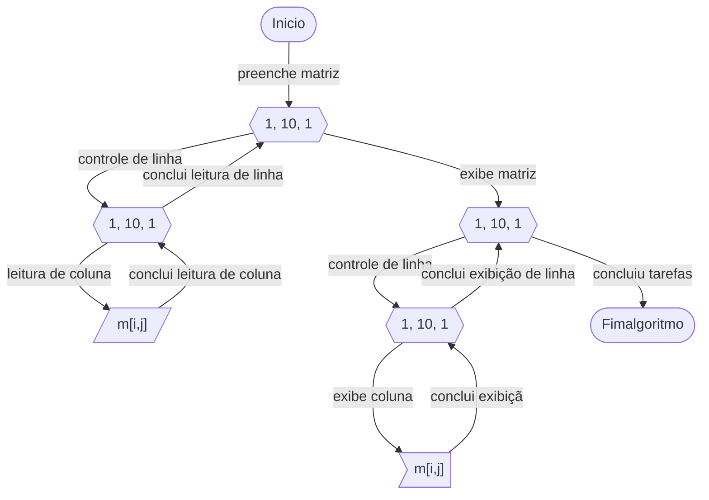

# escola-vr

# Exercícios

## Vetores (Matrizes de 2 dimensões)

### Warming-Up
Estes exercícios são para aquecimento para que vocês possam assimiliar a estrutura das matrizes de 2 dimesnões ou seja, reforçar o entendimento sobre o funcionamento, a forma com a qual associamos dados aos 2 índices utilizados, o indice de linha e o índice de coluna, assim com a forma com a qual percorremos todos os dados da matriz.

Como voce pode perceber, para trabalhar com uma matriz, nós precisamos utilizar uma estrura de repetição encadeada.

A estrutura de repetição externa controla o percurso entre as linhas e a estrutura interna controla o percurso entre as colunas.

Devemos sempre estar atentos aos índices que representam as linhas e colunas para cada elemento pois, cada elemento da matriz possui um papel semantico, este papel significa que cadas posição representa um dado em um doínio de problema.

> Por exemplo, uma matriz de 5 linhas por 7 colunas poderia representar os dias de um mês ou poderiam representar 5 produtos e cada um produto poderia ter dados como código, código de barras, descrição, descrição reduzida, preço, data de validade, impostos.

As matrizes simplificam a utilização de multiplos dados inter-relacionados mas em contra-partida requer mais controle com utilização de estruturas mais complexas.

### Exercícios

ID | Descrição | Solução
-- | -- | --
1 | Ler e apresentar os elementos de uma matriz numérica de 2 dimensões contendo 7 linhas e 5 colunas| [WIP](../resources/entrega5/EX_MAT_X.ALG)
2 | Ler os elementos de uma matriz numérica de 2 dimensões contendo 7 linhas e 7 colunas. Após a leitura apresentar apenas os valores pares, quando um valor for ímpar exibir apenas um caracter de espaço. | [WIP](../resources/entrega5/EX_MAT_X.ALG)
3 | Ler os elementos de uma matriz A e outra B, ambas numéricas de 2 dimensões contendo 7 linhas e 7 colunas. Após a leitura das matrizes criar uma matriz C de mesma dimensão com as somas das respectivas posições em A e B. Após realizar a soma das matrizes, apresete-as. | [WIP](../resources/entrega5/EX_MAT_X.ALG)
4 | Ler uma matriz numérica de 2 dimensões contendo 5 linhas e 5 colunas. Após a leitura exiba a matriz diagonal.| [WIP](../resources/entrega5/EX_MAT_X.ALG)
5 | Ler uma matriz numérica de 2 dimensões contendo 5 linhas e 5 colunas. Esta matriz deve permitir apenas a entrada de números ímpares, quando um valor par for digitado, o algoritmo deve exibir uma mensagem de alerta e solicitar uma nova leitura de um valors ímpar. Após a leitura exiba a matriz.| [WIP](../resources/entrega5/EX_MAT_X.ALG)

