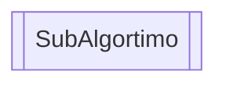
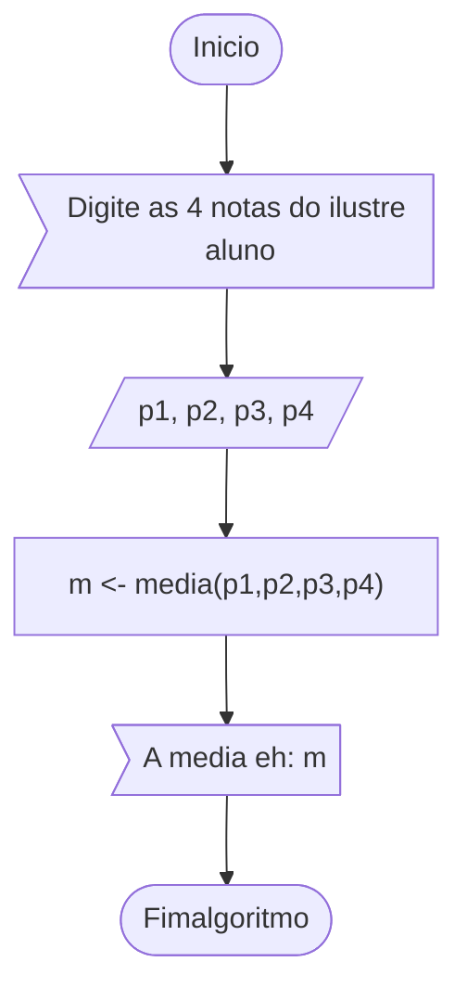
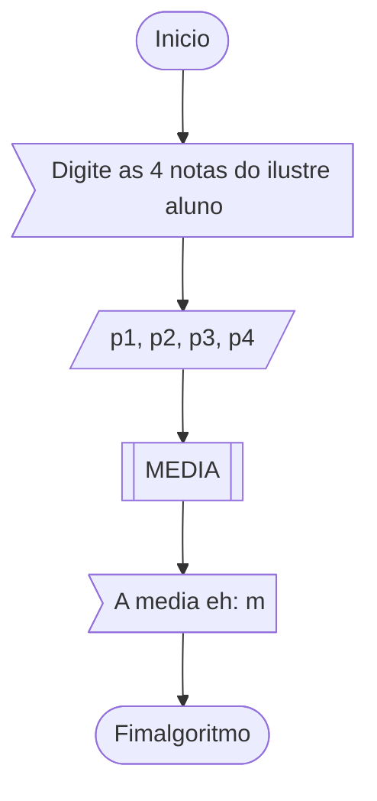
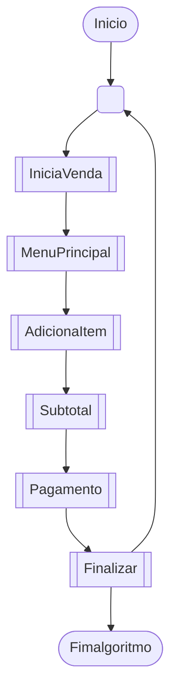

# escola-vr

# Exercícios

## Subalgoritmos

Os subalgortimos são em sua essência blocos de instruções encapsuladas em uma estrutura que nos fornece uma interface ou identificador para que este bloco seja utilizado em quaisquer partes de um algortimo mais longo e complexo.

Os subalgoritmos nos permitem modularizar partes de um algoritmo complexo em partes menores.

Modularizar significa dividir um algoritmo em vários algoritmos menores, e cada um destes menores algoritmos deve ter uma função específica. Esta função específica pode ser reutilizada em outras partes do algoritmo complexo.


### Representação de um Subalgoritmo

Os subalgortimos são respresentados pela forma abaixo.



#### Exemplo

O exemplo abaixo simboliza um subalgoritmo que deverá calcular uma media de valores, em nosso caso notas clássicas de um ilustre aluno.



Nesta representação temos a ideia de abstração de um subalgoritmo que isoladamente deverá realizar um cálculo em vários pontos de um algortimo maior.

A representação exata do cálculo será implementada no pseudocódigo abaixo.

```
Algoritmo "subalgortimos"
Var

   // Declaracao de subalgoritmo eh sempre feita na area de declaracao de variaveis
funcao media(a,b,c,d: real): real
inicio
   retorne (a+b+c+d)/4
fimfuncao

p1, p2, p3, p4, m: real
Inicio

   escreval("Digite as 4 notas do ilustre aluno...")
   leia(p1,p2,p3,p4)

   // Chamada do subalgoritmo
   m <- media(p1,p2,p3,p4)

   escreval("A media eh ", m:3:1)

Fimalgoritmo
```

Mas sua abstração seria da  exemplificada abaixo. Neste caso temos a abstração do subalgortimo e sua implementação é mostrada apenas no pseudocódigo, ou seja no algorimos precisamos apenas saber que um subalgoritmo será responmsável pelo cálculo da média; esta é a beleza da abstração, nos prendemos aos passos lógicos para a resoluçao e deixamos os detalhes para a implementação.  



### Benefícios dos subalgoritmos

A modularizaçao nos permite focar em partes específicas de um problema utilizando a metodologia `top-down` para divisão da solução em partes cada vez menores e interoperáveis.

No exemplo abaixo podemos ver a abstração de um uma venda em um carrinhos de compras. Para finalizarmos uma compra precisamos adicionar itens, realizar os cálculos da somatória dos itens, descontos, impostos, dentre outros; cada um destes passos da venda é realizado por um subalgoritmo, sendo que cada um deles deve realizar apenas um grupo de instruções reduzidas e muito específicas.

> Podemos verificar que a venda é um algoritmo que utiliza vários subalgoritmos para concluir o fluxo integral de uma venda. Cada subalgoritmo tem internamente o seu grupo de instruções.

#### Abstraçao de utilização de subalgortimos em uma venda



### Exercícios

Nesta lista de exercícios iremos reforçar o entendimento sobre subalgortimos criando **procediementos** (subalgoritmos que não possuem retorno) e **funções** (subalgorimos que possuem retorno).

#### Procedimentos

ID | Descrição | Solução
-- | -- | --
1 | Crie um procedimento chamado biscoito_da_sorte. Este procedimento deverá exibir para o usuário uma aleatória mensagem da sorte, simulando o biscoito da sorte. Crie pelo menos 5 mensagens para sortear.| [WIP](../resources/entrega5/EX_FUN_X.ALG)
2 | Crie um procedimento que exiba a sequencia de Fibonacci; o procedimento deverá receber como parametro o valr de limite da sequencia.| [WIP](../resources/entrega5/EX_MAT_X.ALG)
3 | Crie um procediemnto que exiba uma sequencia de tabuadas. Este procedimento deverá receber como parametro o valor inicial e o valor final. | [WIP](../resources/entrega5/EX_MAT_X.ALG)
4 | Crie um procedimento que ordene um vetor numérico.| [WIP](../resources/entrega5/EX_FUN_X.ALG)

#### Funções

ID | Descrição | Solução
-- | -- | --
1 | Crie uma função que valide se um valor numério é par ou ímpar. O tipo do retorno deverá ser lógico.| [WIP](../resources/entrega5/EX_FUN_X.ALG)
2 | Crie uma função que valide se um valor numério é primo. O tipo do retorno deverá ser lógico.| [WIP](../resources/entrega5/EX_FUN_X.ALG)
3 | Crie uma função que retorne a conversão de graus de temperatura. Esta função deverá receber como parametros um caracter que represente os graus em celsius ou farenheit e um valor que represente a temperatura. A função deverá converter o valor da temperatura com base nos argumentos recebidos. | [WIP](../resources/entrega5/EX_FUN_X.ALG)
4 | Considerando a necessidade de desenvolver uma agenda que contenha nomes, endereços e telefones de dez pessoas, defina a estrutura de registro apropriada, os diagramas de blocos e a codificação em português estruturado de um programa que, com o uso de subprogramas, apresente um menu e suas respectivas rotinas para a execução das seguintes etapas: <br>**a**). Cadastrar os dez registros. <br>**b**). Pesquisar os dez registros, um de cada vez, pelo campo nome (usar método sequencial). <br>**c**). Classificar por ordem alfabética os registros cadastrados. <br>**d**). Apresentar todos os registros. <br>**e**). Sair do programa de cadastro. | [WIP](../resources/entrega5/EX_FUN_X.ALG)
5 | Considerando a necessidade de um programa de computador que armazene o nome e as notas bimestrais de 20 alunos do curso de Técnicas de Programação, defina a estrutura de registro apropriada e a codificação em português estruturado de um programa que, com o uso de subalgoritmos, apresente um menu e suas respectivas rotinas para a execução das seguintes etapas: <br>**a**). Cadastrar os 20 registros (após o cadastro, fazer a classificação por nome). <br>**b**). Pesquisar os 20 registros, um de cada vez, pelo campo nome (usar o método binário; nessa pesquisa, o programa deve também apresentar a média do aluno e as mensagens “Aprovado”, caso a média seja maior ou igual a 5, ou “Reprovado” para média abaixo de 5). <br>**c**). Apresentar todos os registros, médias e a mensagem de aprovação ou reprovação. <br>**d**). Apresentar apenas os registros e as médias dos alunos aprovados. <br>**e**). Apresentar apenas os registros e as médias dos alunos reprovados.<br>**f**). Sair do programa de cadastro. | [WIP](../resources/entrega5/EX_FUN_X.ALG)


