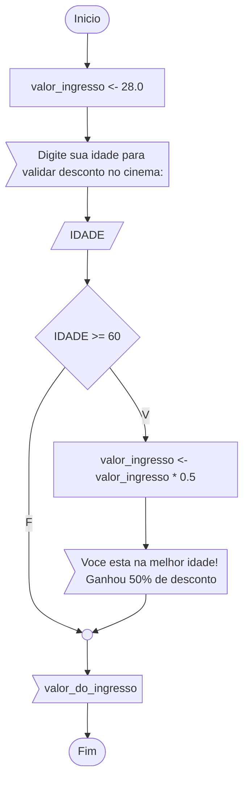
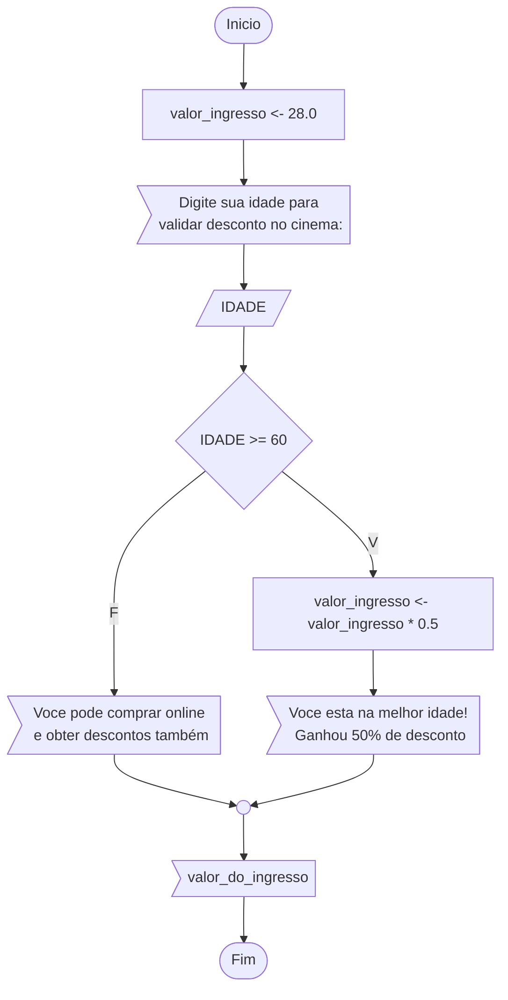
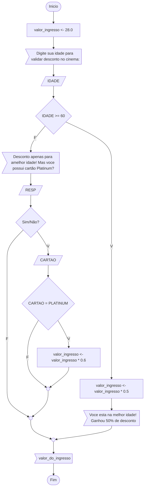

# escola-vr

# Exercícios

## Extruturas de Controle

Como discutimos em sala de aula; as estruturas de controle nos permitem dar o controle ao algoritmo, ou seja, os algorimos com base na lógica booleana podem tomar decisões; podendo tomar fluxos alternativos com base na interpretação de uma expressão de validação.

> Abaixo teremos as estrutuas e alguns exemplos de utilização para validar descontos na compra de ingresso ao cinema.

## Estrutura de decisão/controle simples

Na estrutura de controle simples nós podemos aplicar o desconto caso a idade do usuário tenha 60 anos ou mais; note que caso o usuario tenha menos de 60 anos nenhuma ação é executada.

> Os exemplos abaixo estão utilizando o diagrama de blocos para melhor visualização dos fluxos condicionais das estruturas de controle. Foi nexessário adaptar os simbolos de exibição no mermaid-js, o mermaid-js pemite a criação de diagramas em arquivos .md (markdown) no github; utilizaremos o paraleograma como entrada de dados e a "bandeira" como saída de dados em substituição às formas geométricas padronizadas do diagrama de blocos apresentadas em sala de aula.

## Estrutura de decisão/controle composta

Nesta estrutura de controle composta nós temos 2 fluxos com instruções a serem executadas.
Quando o usuário tiver 60 anos ou mais ele receberá o desconto como na estrutura anterior; porém quando o mesmo tiver menos de 60 anos, será indicada uma possibilidade extra de obter desconto nas compras online.

Note que temos 2 fluxos com execução de instruções.

## Estrutura de decisão/controle encadeada

Na estrutura de controle encadeada nós devemos compreender que cada estrutura de decisão possui 2 possibilidades de execução, a primeira quando o resultado do teste condicional for verdadeiro e outra quando for falso. Para cada uma destas possibilidades podermos incluir quaisquer instruções ou blocos de instruções.

Uma estrutura de controle é um bloco de instrução, sendo um bloco ele pode ser executada como se fosse uma instrução qualquer, desta forma podemos encadear blocos de estruturas de controle consecutivamente.

Nestes casos devemos ter mais cautela com as validações e considerar multiplas fluxos; mas calma que nós iremos realizar mais algumas baterias de exercícios para reforçar os conceitos!

> Note que neste exemplo temos um segundo fluxo de validação de desconto para usuarios de cartões platinum e temos basicamente 3 fluxos distintos.

# Desafio Algoritmo

Consegue implementar o fuxo encadeado em **pseudocódigo**? 

### Desafio Geek

De que filme vem este diálogo?

> "I know Kung Fu".
> "Show me".

